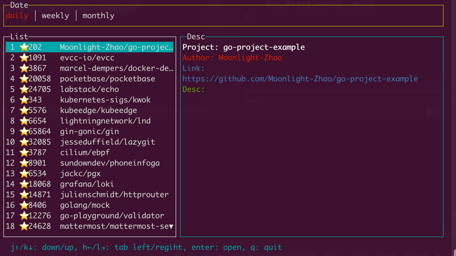

# ghsearch
Search repositories or code in github

## Requirement
You need a github api token which you can get from [here](https://github.com/settings/tokens)

## Installation
`go install -ldflags '-X main.GITHUB_TOKEN=${YOUR_API_TOKEN}' github.com/byebyebruce/ghsearch/cmd/ghsearch@master`  
or  
`go install github.com/byebyebruce/ghsearch/cmd/ghsearch@latest`  

## Usage
- search repo: `ghsearch microservice grpc`
- search code: `ghsearch --lang=rust --code example grpc`
- help: `ghsearch -h`
- if you didn't build github api token into bin you should use: `GITHUB_TOKEN=xxx ghsearch microservice grpc`

---
---
# ghtrend
Show github trending

## Installation
`go install github.com/byebyebruce/ghsearch/cmd/ghtrend@master`

## Usage
- show: `ghtrend`  
- help: `ghtrend -h`
- specific your language: `ghtrend -lang=rust`

## Key (vim style)
up:`j/↑`  
down: `k/↓`  
open link: `enter`  